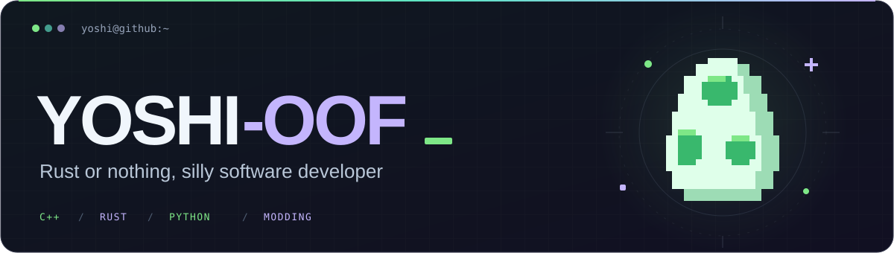
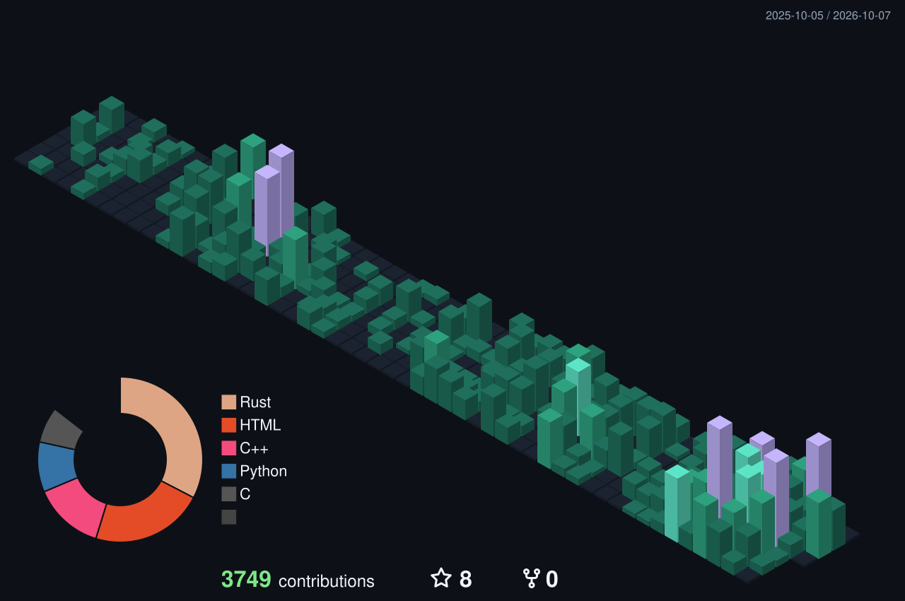

<!-- GitHub profile of Yoshi-OOF. Banner stored in this repository; badges provided by Shields.io. -->

  

  <a href="https://github.com/Yoshi-OOF?tab=repositories"><strong>Repositories ↗</strong></a>
  &nbsp;·&nbsp;
  <a href="#yoshi-languages">Languages ↓</a>
  &nbsp;·&nbsp;
  <a href="#yoshi-activity">Activity ↓</a>

## `01` &nbsp; Hey, I'm Yoshi 👋

Mostly **C++ / Rust**, with a questionable amount of time spent on **SDKs, game internals and modding**. 
I build stuff, break stuff, and occasionally understand why. 
<strong>Rust or nothing.</strong>

## `02` &nbsp; Languages I love to cook with

  

## `03` &nbsp; GitHub Activity

  

